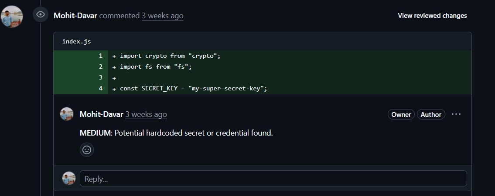

# PR Reviewer

A GitHub Action that performs a comprehensive security review of Pull Requests. Built with **TypeScript** and powered by **OpenAI** and **Octokit**, this tool acts as your first line of defense, automatically flagging potential vulnerabilities directly in your PR comments.

## Features

- **Dual-Layer Analysis**: Combines lightning-fast static regex scanning with deep-context LLM analysis.
- **Context-Aware Reviews**: The AI understands the context of the diff and reviews it just like a human Security Engineer.
- **Targeted Feedback**: Posts inline comments exactly where the vulnerable code was introduced.
- **Smart Filtering**: Automatically ignores lockfiles, binaries, and system files to save token costs and reduce noise.

## Demo



[Complete PR Review](https://github.com/Mohit-Davar/mifos-test/pull/6)

## Architecture

The application is structured to decouple the fetching, parsing, and analysis phases:

1. **Trigger & Fetch**: Triggered on `pull_request` events. Uses `@actions/github` and `@octokit/rest` to securely fetch the raw git diff of the PR.
2. **Parsing & Filtering (`src/features/pr/git-diff`)**: Parses the raw diff string into structured objects (`parse-diff`). Filters out non-source files (e.g., `.lock`, images, `.DS_Store`).
3. **Static Analysis (`src/features/pr/security-engine`)**: A first-pass regex engine that scans for obvious highly critical issues:
   - Hardcoded Secrets (AWS keys, Private Keys, Generic API tokens)
   - Dangerous functions (e.g., `eval()`, `exec()`)
4. **LLM Analysis (`src/features/pr/llm-call`)**: Passes the structured diff and the static findings to a LLM model. The LLM is prompted to act as a strict Security Engineer, validating the regex findings (to reduce false positives) and finding complex logic flaws (OWASP top 10).
5. **Commenting (`src/features/pr/octokit`)**: Aggregates all valid findings and posts them back to GitHub as inline review comments.

## Setup & Usage

### 1. GitHub Workflow

Create a new workflow file in your repository (e.g., `.github/workflows/security-review.yml`):

```yaml
name: AI Security Review
on:
  pull_request:
    types: [opened, synchronize]

jobs:
  review:
    runs-on: ubuntu-latest
    permissions:
      contents: read
      pull-requests: write
    steps:
      - uses: actions/checkout@v4

      - name: Run PR Reviewer
        uses: your-username/pr-review@main # Replace with the actual repository
        with:
          GITHUB_TOKEN: ${{ secrets.GITHUB_TOKEN }}
          OPENAI_API_KEY: ${{ secrets.OPENAI_API_KEY }}
```

### 2. Environment Variables / Secrets required

| Secret/Input     | Description                                                                                 |
| :--------------- | :------------------------------------------------------------------------------------------ |
| `GITHUB_TOKEN`   | Automatically provided by GitHub Actions (ensure it has `pull-requests: write` permission). |
| `OPENAI_API_KEY` | Your OpenAI API key for LLM analysis. Store this in your repository's **Secrets**.          |

## Development

This project uses **Bun** for fast execution and package management.

```bash
bun install

bun run start
```
